<!-- ═══════════════════════════  HEADER  ═══════════════════════════ -->
<div align="center">


<a href="https://git.io/typing-svg"></a>

<br/>

<a href="https://www.linkedin.com/in/jeison-guarguati-696279366/"></a>
<a href="mailto:jeisonensp03@gmail.com"></a>
<a href="https://huggingface.co/JeiGeek"></a>


</div>

<br/>

<!-- ═══════════════════════════  WHOAMI  ═══════════════════════════ -->

<div align="center">
  
</div>

<br/>

Estudiante de **Ingeniería de Sistemas** enfocado en **Inteligencia Artificial**. Me considero una persona **persistente**, **disciplinada** y **trabajadora**, con una gran pasión por el aprendizaje continuo y por construir soluciones que generen **impacto real en la sociedad** — desde el desminado humanitario hasta el diagnóstico médico.

```python
class Jeison:
    def __init__(self):
        self.rol        = "Estudiante de Ingeniería de Sistemas"
        self.enfoque    = ["Deep Learning", "Computer Vision", "Ciencia de Datos"]
        self.aprendiendo = ["Vision Transformers", "Segmentación médica", "MLOps"]
        self.superpoder = "explicar lo que entiendo a otros 🤝"
        self.motor      = "la disciplina tarde o temprano vencerá la inteligencia"

    def objetivo(self):
        return "Entrenar modelos que ayuden a personas, no solo que suban métricas."
```

<!-- ═══════════════════════════  STACK  ═══════════════════════════ -->
<h2 align="center">🧪 Tecnologías que estoy aprendiendo</h2>

<div align="center">
<table>
  <tr>
    <td width="170" align="center"><b>🧠 Deep Learning</b></td>
    <td>
      
      
      
      
    </td>
  </tr>
  <tr>
    <td align="center"><b>👁️ Computer Vision</b></td>
    <td>
      
      
      
      
    </td>
  </tr>
  <tr>
    <td align="center"><b>📊 Ciencia de Datos</b></td>
    <td>
      
      
      
      
      
    </td>
  </tr>
  <tr>
    <td align="center"><b>⚙️ Entorno</b></td>
    <td>
      
      
      
      
      
    </td>
  </tr>
</table>
</div>

<!-- ═══════════════════════════  DATOS CURIOSOS  ═══════════════════════════ -->
<h2>🎲 Datos curiosos sobre mí</h2>

<table>
  <tr>
    <td width="50%" valign="top">🛰️ Anoté <b>a mano 360 imágenes térmicas</b> para enseñarle a una IA a encontrar minas antipersona.</td>
    <td width="50%" valign="top">📄 Mi primer proyecto de investigación terminó convertido en un <b>paper</b>.</td>
  </tr>
  <tr>
    <td valign="top">🧠 Le he enseñado a una red neuronal a ver <b>lesiones dentro del cerebro</b> en resonancias magnéticas.</td>
    <td valign="top">🐼 Mi equipo de IA se llama <b>LosPandas</b> — sí, por la librería.</td>
  </tr>
  <tr>
    <td valign="top">🤝 Aprendo más cuando <b>le explico a otros</b> lo que entendí.</td>
    <td valign="top">🔁 Mi bucle favorito: <code>while True: aprender()</code></td>
  </tr>
</table>

<h2>🌱 Ahora mismo</h2>

- 🔭 Investigando en **visión por computador** con el semillero *Hands-on Computer Vision*.
- 📚 Profundizando en **Vision Transformers** y **segmentación de imágenes médicas**.
- 🎯 Meta: llevar mis modelos del notebook a **aplicaciones reales (MLOps)**.

<!-- ═══════════════════════════  PROYECTOS  ═══════════════════════════ -->
<h2>🔬 Proyectos destacados</h2>

<table>
  <tr>
    <td width="50%" valign="top">
      <h3>🛰️ <a href="https://github.com/JeiGeek/ThermalMineDetector">ThermalMineDetector</a></h3>
      Detección de <b>minas antipersona</b> en imágenes térmicas aéreas. Fine-tuning de ResNet, ConvNeXt, <b>ViT</b> y Swin para clasificar, y <b>YOLOv11</b> entrenado con 360 imágenes que anoté a mano para detectar.
      <br/><br/>
      
      
      
      <br/>
      <sub>PyTorch · Hugging Face · W&amp;B · YOLO · Semillero Hands-on Computer Vision</sub>
    </td>
    <td width="50%" valign="top">
      <h3>🩻 <a href="https://github.com/JeiGeek/dwi-adc-stroke-segmentacion">dwi-adc-stroke-segmentacion</a></h3>
      Segmentación automática de <b>lesiones por ACV isquémico</b> en resonancias magnéticas (dataset ISLES). Entrada de doble canal <b>DWI + ADC</b>, comparando U-Net contra DeepLabV3+ y distintas funciones de pérdida.
      <br/><br/>
      
      
      <br/>
      <sub>TensorFlow · Keras · U-Net · DeepLabV3+ · Dice Loss</sub>
    </td>
  </tr>
  <tr>
    <td width="50%" valign="top">
      <h3>📊 <a href="https://github.com/JeiGeek/ia1-LosPandas-prediccion_rendimiento_estudiantil">Predicción de rendimiento estudiantil</a></h3>
      ¿Qué factores influyen realmente en las notas? EDA, regresión, clasificación, clustering (K-Means, DBSCAN) y reducción de dimensionalidad (PCA, t-SNE) sobre 6 607 estudiantes.
      <br/><br/>
      
      
      
      <br/>
      <sub>Pandas · scikit-learn · Keras · Seaborn</sub>
    </td>
    <td width="50%" valign="top">
      <h3>🚚 <a href="https://github.com/JeiGeek/Mensajeria_con_grafos">Mensajería con grafos</a></h3>
      Simulador de rutas óptimas para camiones de paquetería con <b>Floyd-Warshall</b> sobre 51 ciudades de Colombia, con tráfico aleatorio que altera los tiempos de viaje e interfaz gráfica.
      <br/><br/>
      
      
      <br/>
      <sub>Java · Estructuras de datos · Grafos</sub>
    </td>
  </tr>
</table>

<!-- ═══════════════════════════  STATS  ═══════════════════════════ -->
<h2>⚡ Actividad</h2>

<div align="center">
  
  
  <br/>
  
</div>

<br/>

<!-- La serpiente se genera con .github/workflows/snake.yml -->
<picture>
  <source media="(prefers-color-scheme: dark)" srcset="https://raw.githubusercontent.com/JeiGeek/JeiGeek/output/github-snake-dark.svg"/>
  
</picture>

<!-- ═══════════════════════════  CONTACTO  ═══════════════════════════ -->
<h2>📬 Hablemos</h2>

Si te interesa la IA aplicada, la visión por computador o quieres colaborar en un proyecto con impacto social, escríbeme:

<div align="center">
<table>
  <tr>
    <td align="center" width="170">
      <a href="https://www.linkedin.com/in/jeison-guarguati-696279366/"></a>
      <br/><b>LinkedIn</b><br/><sub>jeison-guarguati</sub>
    </td>
    <td align="center" width="170">
      <a href="mailto:jeisonensp03@gmail.com"></a>
      <br/><b>Gmail</b><br/><sub>jeisonensp03@gmail.com</sub>
    </td>
    <td align="center" width="170">
      <a href="https://www.instagram.com/jeison_g003/"></a>
      <br/><b>Instagram</b><br/><sub>@jeison_g003</sub>
    </td>
    <td align="center" width="170">
      
      <br/><b>Discord</b><br/><sub>rolitopower#0834</sub>
    </td>
  </tr>
</table>
</div>

<br/>

<div align="center">

> _"La disciplina tarde o temprano vencerá la inteligencia."_


</div>
